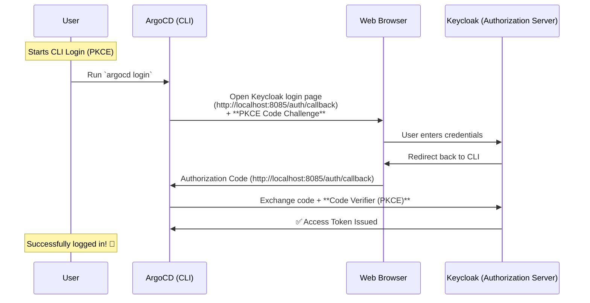

```mermaid
sequenceDiagram
    participant User
    participant ArgoCD_CLI as ArgoCD (CLI)
    participant Browser as Web Browser
    participant Keycloak as Keycloak (Authorization Server)

    Note over User: Starts CLI Login (PKCE)
    
    User->>ArgoCD_CLI: Run `argocd login`
    ArgoCD_CLI->>Browser: Open Keycloak login page<br/> (http://localhost:8085/auth/callback)<br/> + **PKCE Code Challenge**
    Browser->>Keycloak: User enters credentials
    Keycloak->>Browser: Redirect back to CLI
    Browser->>ArgoCD_CLI: Authorization Code (http://localhost:8085/auth/callback)
    ArgoCD_CLI->>Keycloak: Exchange code + **Code Verifier (PKCE)**
    Keycloak->>ArgoCD_CLI: ✅ Access Token Issued
    Note over User: Successfully logged in! 🎉


```
