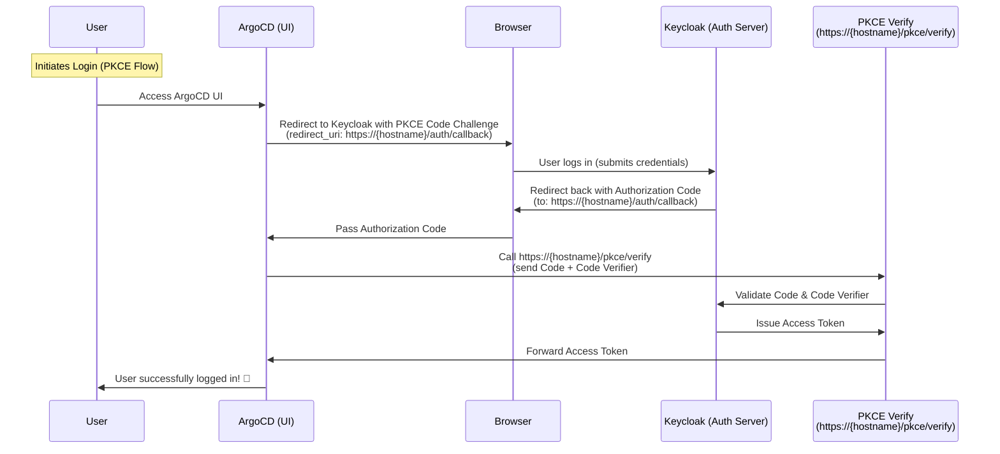

```mermaid
sequenceDiagram
    participant U as User
    participant A as ArgoCD (UI)
    participant B as Browser
    participant K as Keycloak (Auth Server)
    participant P as PKCE Verify<br/>(https://{hostname}/pkce/verify)

    Note over U: Initiates Login (PKCE Flow)
    U->>A: Access ArgoCD UI
    A->>B: Redirect to Keycloak with PKCE Code Challenge<br/>(redirect_uri: https://{hostname}/auth/callback)
    B->>K: User logs in (submits credentials)
    K->>B: Redirect back with Authorization Code<br/>(to: https://{hostname}/auth/callback)
    B->>A: Pass Authorization Code
    A->>P: Call https://{hostname}/pkce/verify<br/>(send Code + Code Verifier)
    P->>K: Validate Code & Code Verifier
    K->>P: Issue Access Token
    P->>A: Forward Access Token
    A->>U: User successfully logged in! 🎉

```
