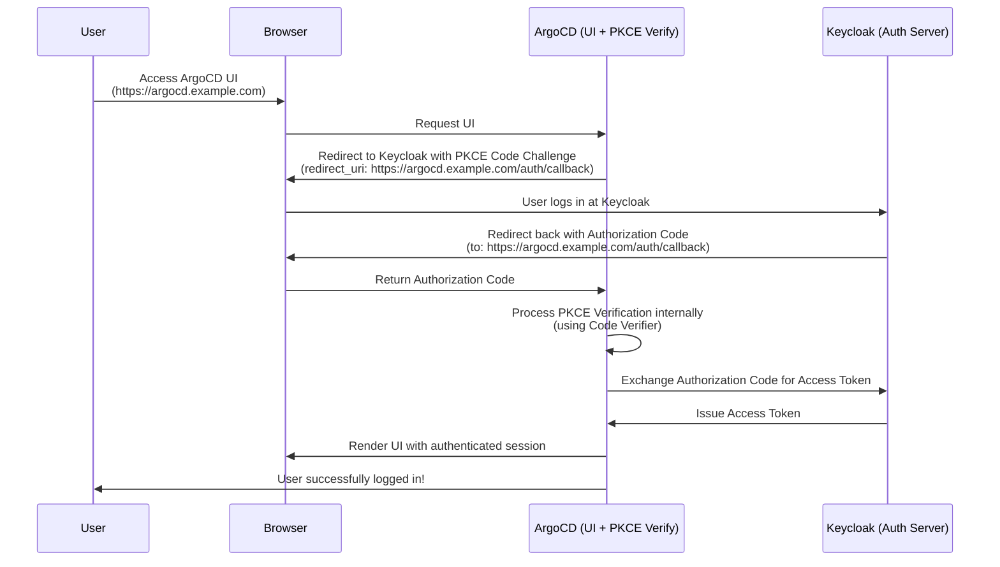

```mermaid
sequenceDiagram
    participant U as User
    participant B as Browser
    participant A as ArgoCD (UI + PKCE Verify)
    participant K as Keycloak (Auth Server)

    U->>B: Access ArgoCD UI<br/>(https://argocd.example.com)
    B->>A: Request UI
    A->>B: Redirect to Keycloak with PKCE Code Challenge<br/>(redirect_uri: https://argocd.example.com/auth/callback)
    B->>K: User logs in at Keycloak
    K->>B: Redirect back with Authorization Code<br/>(to: https://argocd.example.com/auth/callback)
    B->>A: Return Authorization Code
    A->>A: Process PKCE Verification internally<br/>(using Code Verifier)
    A->>K: Exchange Authorization Code for Access Token
    K->>A: Issue Access Token
    A->>B: Render UI with authenticated session
    A->>U: User successfully logged in!


```
