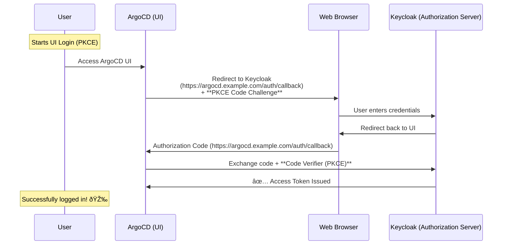

```mermaid
sequenceDiagram
    participant User
    participant ArgoCD_UI as ArgoCD (UI)
    participant Browser as Web Browser
    participant Keycloak as Keycloak (Authorization Server)

    Note over User: Starts UI Login (PKCE)
    
    User->>ArgoCD_UI: Access ArgoCD UI
    ArgoCD_UI->>Browser: Redirect to Keycloak<br/> (https://argocd.example.com/auth/callback)<br/> + **PKCE Code Challenge**
    Browser->>Keycloak: User enters credentials
    Keycloak->>Browser: Redirect back to UI
    Browser->>ArgoCD_UI: Authorization Code (https://argocd.example.com/auth/callback)
    ArgoCD_UI->>Keycloak: Exchange code + **Code Verifier (PKCE)**
    Keycloak->>ArgoCD_UI: ✅ Access Token Issued
    Note over User: Successfully logged in! 🎉

```
